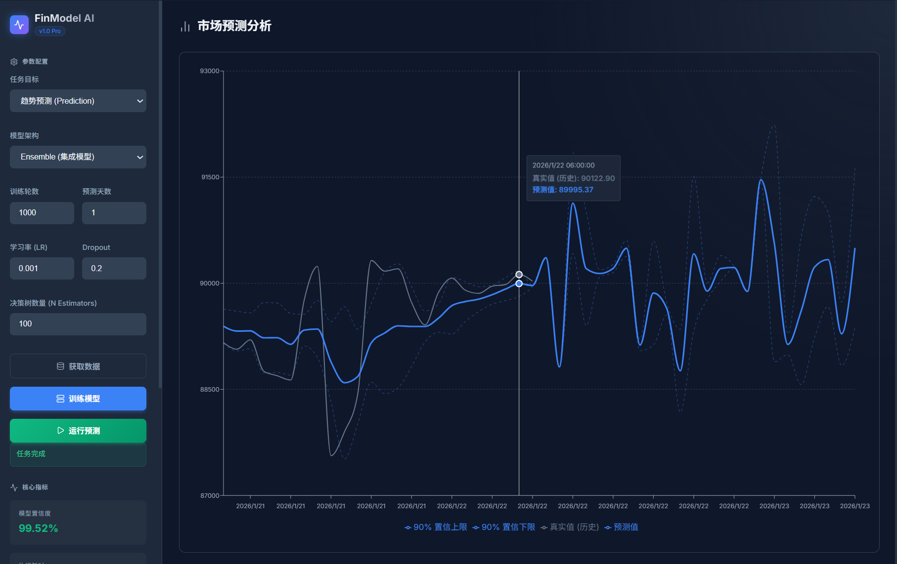

# Automated Financial Model Training System

# 自动化金融模型训练系统



## 📖 Introduction / 项目简介

This is an enterprise-grade automated financial model training and prediction system designed for quantitative trading and risk management. It integrates a modern React frontend with a robust FastAPI backend, leveraging advanced machine learning (Random Forest) and deep learning (LSTM) algorithms to analyze financial data, predict market trends, and assess risks.

这是一个企业级的自动化金融模型训练与预测系统，专为量化交易和风险管理设计。它集成了现代化的 React 前端和稳健的 FastAPI 后端，利用先进的机器学习（随机森林）和深度学习（LSTM）算法来分析金融数据、预测市场趋势并评估风险。

### Key Features / 核心特性

- **Multi-Architecture Support / 多架构支持**:
    - **LSTM (Long Short-Term Memory)**: Deep learning model optimized for time-series forecasting with memory capabilities. Supports Dropout and L2 regularization.
    - **Random Forest**: Ensemble learning method for robust regression and classification tasks.
    - **Ensemble Model**: Weighted fusion of LSTM and Random Forest to reduce variance and improve prediction stability.
- **Advanced Training Pipeline / 高级训练流程**:
    - **TimeSeriesSplit Cross-Validation**: Strict time-series cross-validation to prevent look-ahead bias.
    - **Grid Search**: Automated hyperparameter tuning for optimal model performance.
    - **Data Drift Detection**: Real-time monitoring of data distribution changes using KS Test.

- **Comprehensive Risk Management / 全面风险管理**:
    - **VaR (Value at Risk)**: Calculation of potential loss at 95% confidence level.
    - **Volatility Analysis**: Annualized volatility tracking.
    - **Drawdown Assessment**: Historical maximum drawdown calculation.

- **Interactive Visualization / 交互式可视化**:
    - Real-time training progress monitoring.
    - Interactive charts with confidence intervals (90% prediction bounds).
    - Risk assessment dashboards.

## 🛠 Tech Stack / 技术栈

- **Frontend / 前端**: React, Vite, Recharts, Lucide React, Axios
- **Backend / 后端**: Python, FastAPI, Uvicorn, Pandas, Scikit-learn, PyTorch
- **Infrastructure / 基础设施**: Docker, Docker Compose, Nginx

## � Data Source & Configuration / 数据源与配置

### Data Source / 数据来源

The system fetches real-time and historical financial data from **Binance** (world's leading cryptocurrency exchange). The data pipeline handles:

- Market data acquisition (Kline/Candlestick data)
- Technical indicator calculation (MA, RSI, MACD, Bollinger Bands)
- Data cleaning and normalization

本系统的数据来源于 **Binance (币安)** 交易所。数据管道负责处理：

- 市场行情数据获取 (K线数据)
- 技术指标计算 (MA, RSI, MACD, 布林带等)
- 数据清洗与归一化

### Environment Configuration / 环境配置

To access the data source, you need to configure your API keys in a `.env` file at the project root.
为了访问数据源，您需要在项目根目录创建一个 `.env` 文件并配置 API 密钥。

**Example `.env` file / `.env` 文件示例**:

```env
BINANCE_API_KEY=your_api_key_here
BINANCE_SECRET_KEY=your_secret_key_here
```

_Note: Ensure your API keys have read-only permissions for security._
_注意：请确保您的 API 密钥仅拥有只读权限以保证安全。_

## �🚀 Getting Started / 快速开始

### Prerequisites / 前置要求

- Docker & Docker Compose
- Node.js 18+ (for local development)
- Python 3.10+ (for local development)

### Deployment with Docker / 使用 Docker 部署

1. **Clone the repository / 克隆仓库**:

    ```bash
    git clone <repository-url>
    cd <project-directory>
    ```

2. **Build and Run / 构建并运行**:

    ```bash
    docker-compose up --build -d
    ```

3. **Access the Application / 访问应用**:
    - Frontend: http://localhost:80
    - Backend API Docs: http://localhost:8000/docs

### Local Development / 本地开发

#### Backend / 后端

```bash
# Create virtual environment
python -m venv venv
source venv/bin/activate  # Windows: venv\Scripts\activate

# Install dependencies
pip install -r requirements.txt

# Run server
uvicorn system_integration.api.main:app --reload
```

#### Frontend / 前端

```bash
cd frontend

# Install dependencies
npm install

# Run dev server
npm run dev
```

## 📊 Model Configuration / 模型配置

| Parameter              | Description                   | Default | Applicable Models       |
| ---------------------- | ----------------------------- | ------- | ----------------------- |
| **Epochs**             | Number of training iterations | 10      | LSTM, Ensemble          |
| **Learning Rate (LR)** | Step size for optimizer       | 0.001   | LSTM, Ensemble          |
| **Dropout**            | Regularization rate           | 0.2     | LSTM, Ensemble          |
| **N Estimators**       | Number of trees in the forest | 100     | Random Forest, Ensemble |
| **Days**               | Prediction horizon            | 30      | All                     |

## 下一阶段优化方向

1. 高级模型架构 ：引入Transformer、Temporal Fusion Transformer等更先进的模型
2. 强化学习集成 ：结合强化学习进行动态决策和风险管理
3. 多资产联动分析 ：添加多资产相关性分析和联动预测
4. 实时数据处理 ：优化数据处理流程，支持实时数据更新
5. 高级风险控制 ：添加动态止损、仓位管理和风险预算分配
6. 模型监控与更新 ：实现模型性能监控和自动更新机制

## 🛡️ License / 许可证

This project is licensed under the MIT License. See the LICENSE file for details.

---

_Developed by Expert Quantitative Engineering Team._
_由资深量化工程团队开发。_
